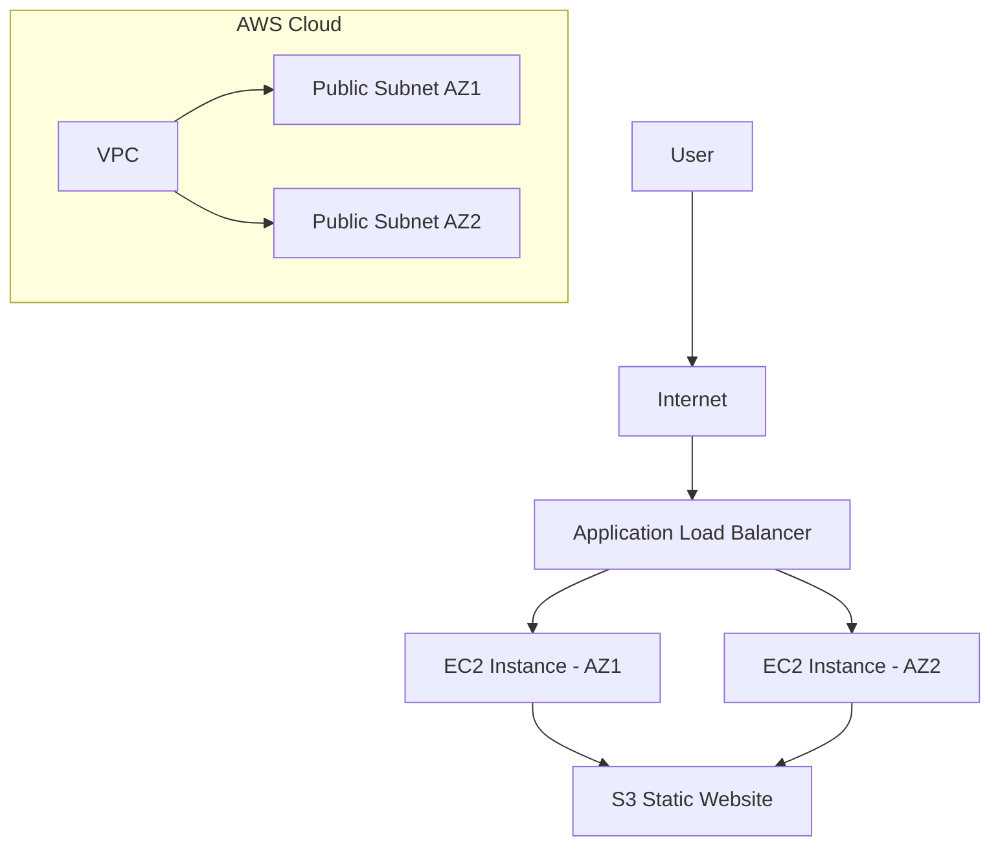
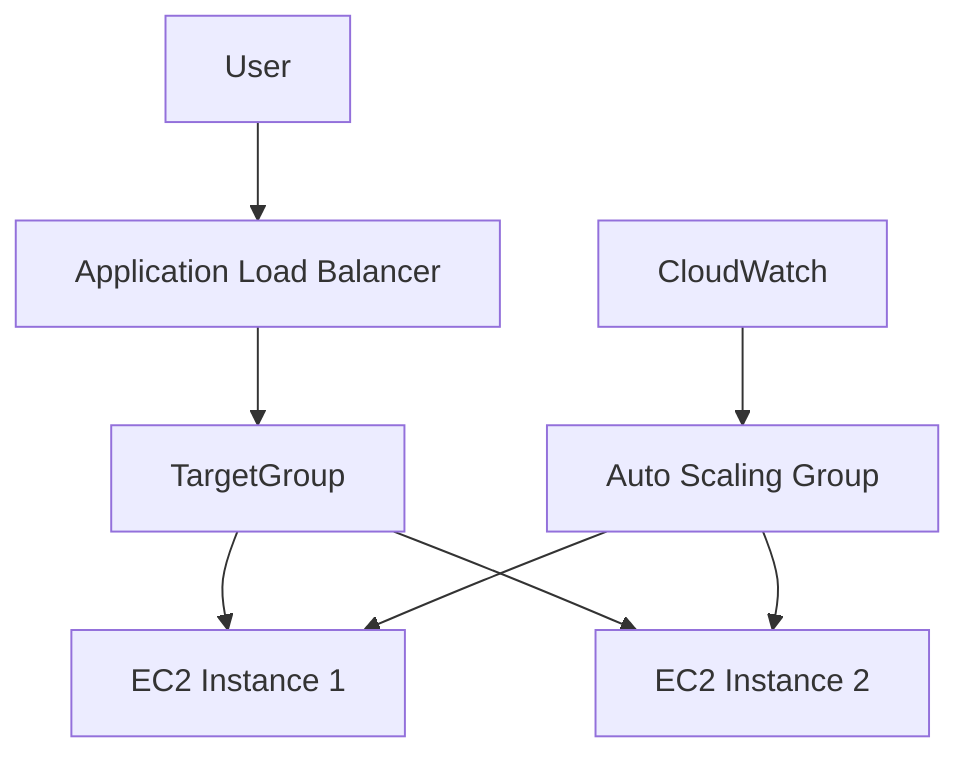
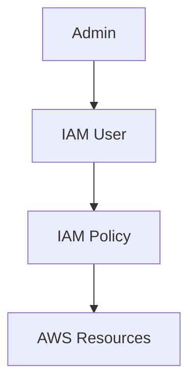

# 🚀 Terraform AWS Infrastructure Automation


This repository contains Infrastructure as Code (IaC) implementations using **Terraform** to provision and manage AWS cloud resources in a modular and production-oriented approach.

The objective of this project is to demonstrate real-world **DevOps engineering skills** including cloud automation, scalable infrastructure design, networking, and security best practices.

This project simulates how infrastructure is provisioned in enterprise environments using Terraform.

---

# 📌 Key Features

✅ AWS Infrastructure Automation
✅ Custom VPC Deployment
✅ EC2 Provisioning
✅ Application Load Balancer
✅ Auto Scaling Group
✅ IAM User & Policy Management
✅ S3 Static Website Hosting
✅ Infrastructure as Code Best Practices

---

# 🏗️ Architecture Diagram

## 🌐 Overall AWS Infrastructure



---

## ⚖️ Auto Scaling & Load Balancer Architecture



---

## 🔐 IAM Architecture



---

# 📂 Repository Structure

```
terraform/
│
├── iam-user-terraform/        # IAM user creation
├── loadbalance-autoscaling/   # ALB + Auto Scaling configuration
├── s3-static-website/         # Static website hosting using S3
├── vpc-terraform/             # Custom VPC with networking resources
├── ec2.tf                     # EC2 provisioning
└── README.md
```

---

# ☁️ Infrastructure Components

## 1️⃣ IAM Automation

* Creates IAM users
* Attaches policies
* Demonstrates least-privilege access model

Concepts Covered:

* IAM Policies
* Access Control
* Security Best Practices

---

## 2️⃣ VPC Infrastructure

Custom networking environment including:

* VPC
* Public Subnets
* Internet Gateway
* Route Tables
* Security Groups

This replicates production-grade cloud networking.

---

## 3️⃣ EC2 Provisioning

Automated compute resource deployment with:

* Configurable instance types
* Key pair association
* Security groups
* Region configuration

---

## 4️⃣ S3 Static Website Hosting

Includes:

* Bucket creation
* Public access configuration
* Static hosting enablement
* Website endpoint exposure

---

## 5️⃣ Load Balancer & Auto Scaling

High-availability architecture using:

* Application Load Balancer (ALB)
* Target Groups
* Launch Template
* Auto Scaling Group
* Health Checks

This demonstrates scalability patterns used in real production systems.

---

# ⚙️ Prerequisites

Before running this project ensure you have:

* AWS Account
* AWS CLI configured
* Terraform installed (>= 1.0)
* IAM credentials with appropriate permissions

Verify installation:

```bash
terraform -v
aws configure
```

---

# 🚀 Deployment Steps

Navigate to any module directory.

Example:

```bash
cd vpc-terraform
terraform init
terraform plan
terraform apply
```

To destroy infrastructure:

```bash
terraform destroy
```

---

# 🔐 Security Best Practices Followed

* Infrastructure as Code version control
* Parameterized configuration
* Least privilege IAM approach
* Modular architecture principles
* Resource tagging readiness
* Environment separation capability

---

# 📈 DevOps Skills Demonstrated

* Terraform
* AWS Cloud
* Infrastructure Automation
* Cloud Networking
* Load Balancing
* Auto Scaling
* IAM Security
* Cloud Architecture Design

---

# 🧠 Future Improvements

Planned enhancements:

* Remote backend using S3 + DynamoDB
* Terraform modules standardization
* CI/CD pipeline with GitHub Actions
* Multi-environment setup (Dev / Stage / Prod)
* Monitoring with CloudWatch
* Infrastructure testing (Terratest)

---

# 📸 Screenshots (Optional)

You can add AWS console screenshots here for better visualization.

Example:

```
/diagrams/alb.png
/diagrams/asg.png
```

---

# 👨‍💻 Author

**Rushi**
DevOps Engineer | Cloud Enthusiast | Infrastructure Automation

---

# ⭐ Contribution

If you find this repository helpful, feel free to star ⭐ the repo and contribute.

---

# 📜 License

This project is created for educational and demonstration purposes.
